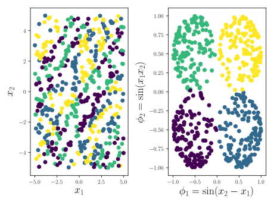

This section describes the basic approach used by FEAT. A more detailed description, along with experiments, 
is available in [this preprint.](https://arxiv.org/abs/1807.00981)

[^1]: La Cava, W., Silva, S., Danai, K., Spector, L., Vanneschi, L., & Moore, J. H. (2018). Multidimensional genetic programming for multiclass classification. Swarm and Evolutionary Computation.
[^2]: Hoerl, A. E., & Kennard, R. W. (1970). Ridge regression: Biased estimation for nonorthogonal problems. Technometrics, 12(1), 55–67.
[^3]: La Cava, W., Helmuth, T., Spector, L., & Moore, J. H. (2018). A probabilistic and multi-objective analysis of lexicase selection and ε-lexicase selection. Evolutionary computation, 1-28.

## Representation Learning

The goal of representation learning in regression or classification is to learn a new representation of your data that makes it easier to model. As an eample, consider the figure below[^1], where each point is a sample belonging to one of 4 colored classes. Here, we want to learn the equations on the axes of the right plot (labelled on the axes), which will make it easier classify the data belonging to each class.   

*(Left) raw data. (Right) Data after transformation according to a 2d representation shown on the axes[^1].*

It's worth noting that the representation in the right panel will be easier for certain machine learning methods to classify, and harder for others. For this reason we've written FEAT to wrap around the Shogun ML toolbox, which means it can learn representations for different ML approaches. The default approach is linear and logistic regression, but currently decision trees (CART), support vector machines (SVM) and random forests are also supported. 

## Approach

FEAT is a wrapper-based learning method that trains ML methods on a population of representations, and optimizes the representations to produce the lowest error. FEAT uses a typical $\mu$ + $\lambda$ evolutionary updating scheme, where $\mu=\lambda=P$. The method optimizes a population of potential representations, $N = \{n_1\;\dots\;n_P\}$, where $n$ is an ``individual" in the population, iterating through these steps: 
    
- Fit a linear model $\hat{y} = \mathbf{x}^T\hat{\beta}$. Create an initial population $N$ consisting of this initial representation, $\mathbf{\phi} = \mathbf{x}$, along with $P-1$ randomly generated representations that sample $\mathbf{x}$ proportionally to $\hat{\beta}$. 
- While the stop criterion is not met: 
    - Select parents  $P \subseteq N$ using a selection algorithm. 
    - Apply variation operators to parents to generate $P$ offspring $O$; $N = N \cup O$ 
    - Reduce $N$ to $P$ individuals using a survival algorithm.  
- Select and return $n \in N$ with the lowest error on a hold-out validation set. 

Individuals are evaluated using an initial forward pass, after which each representation is used to fit a linear model using ridge regression[^2]. The weights of the differentiable features in the representation are then updated using stochastic gradient descent.  

## Feature representation

FEAT is designed with interpretability in mind. To this end, the representations it learns are sets of equations. The equations are composed of basic operations, including arithmetic, logical functions, control flow and heuristic spits. FEAT also supports many statistical operators for handling sequential data. 

## Selection and Archiving

By default, FEAT uses lexicase selection[^3] as the selection operation and NSGA-II for survival. This allows FEAT to maintain an archive of accuracy-complexity tradeoffs to aid in interpretability. FEAT also supports simulated annealing, tournament selection and random search.
